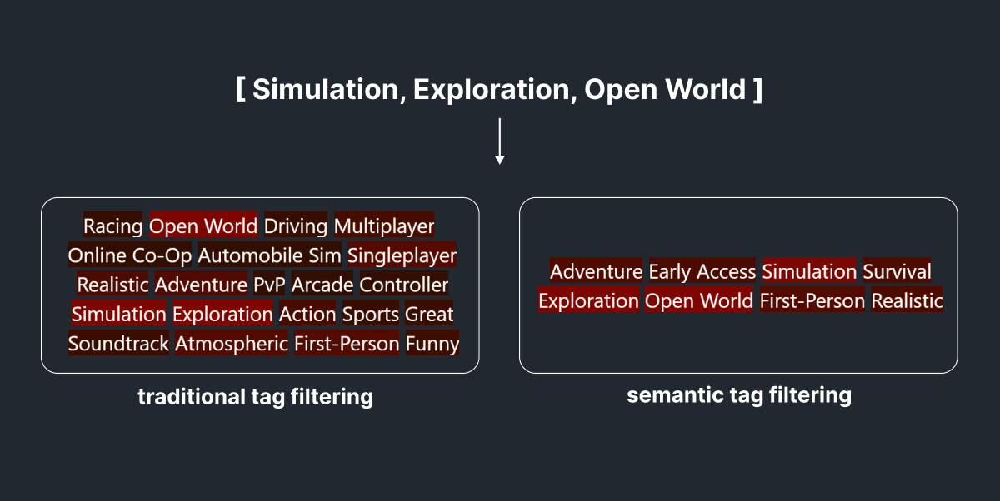
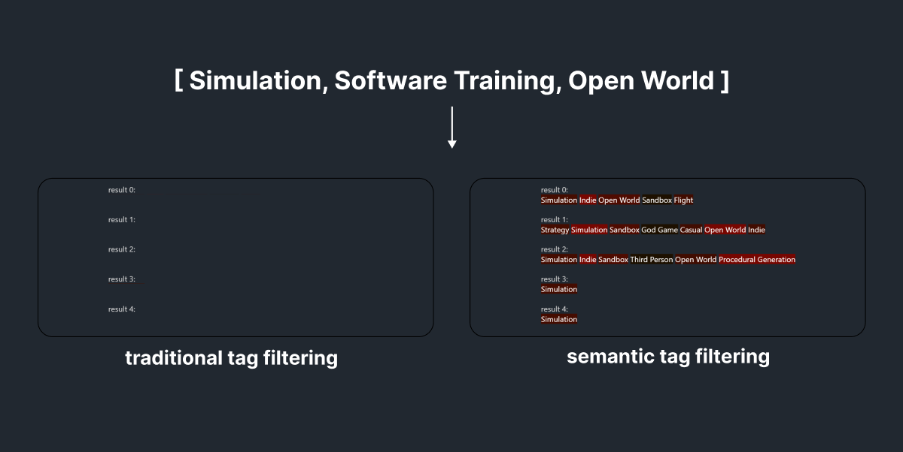
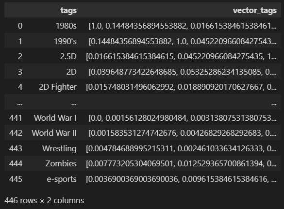

# Please cite
Algorithm: **Semantic Tag Filtering**<br>
Author: **Michelangiolo Mazzeschi**<br>
Published: **2nd September 2024**

# Ref - https://towardsdatascience.com/introducing-semantic-tag-filtering-enhancing-retrieval-with-tag-similarity-4f1b2d377a10

# simtag, semantic tag filtering made easy

The following library [is based on the following technical article](https://medium.com/towards-data-science/introducing-semantic-tag-filtering-enhancing-retrieval-with-tag-similarity-4f1b2d377a10), and aims to introduce semantic search **in tag filtering** using vector-encoded relationships to maximize the overall relevance of the tags.



This search aims to improve the currently used bitwise filtering, which lacks flexibility in providing alternative results when the **regular search cannot retrieve enough samples**.



## Covariate Encoding

This algorithm uses a new encoding method called Covariate Encoding, which employs an optional PCA module to provide high scalability to semantic tag filtering.

To provide better insights into the definitions:
- **sample**: the list of tags associated with an element in our database (ex. a Steam game). We search through our collection of thousands of existing samples.
- **query**: the list of tags that the user has input, the objective is to find a sample matching those tags.

In most encoding algorithms, we encode both queries and samples using the same algorithm. However, each sample contains more than one tag, each represented by a different set of relationships **that we need to capture in a single vector**.


### PCA module

Our first step is to collect all existing tags into a DataFrame, and extract the respective vectors using a pre-trained neural network. For example, all-MiniLM-L6-v2 converts each tag into a vector of length 384.

We can then transpose the obtained matrix, and compress it: we will initially encode our queries/samples using 1 and 0 for the available tag indexes, resulting in an initial vector of the same length as our initial matrix (53,300). At this point, we can use our pre-computed PCA instance to compress the same sparse vector in 384 dims.

We can then transpose the obtained matrix, and compress it: **we will initially encode our queries/samples using 1 and 0 for the available tag indexes**, resulting in an initial vector of the same length as our initial matrix (53,300). At this point, we can use our pre-computed PCA instance to compress the same sparse vector in 384 dims.

#### encoding samples

In the case of our samples, the process ends just right after the PCA compression (when activated).

#### encoding queries

Our query, however, needs to be encoded differently: we need to take into account the relationships associated with each existing tag. This process is executed by first summing our compressed vector to the compressed matrix (the total of all existing relationships). Now that we have obtained a matrix (384x384), we will need to average it, obtaining our query vector.

# using the library

The library contains a set of prepared modules to facilitate the formatting and the computation of the co-occurence matrix, as well as an encoding and search module given the parameters of your sample. If you already want to test it on a working example, you can try the jupyter notebook **notebooks/steam_example.ipynb**, which uses a live example from 40.000 Steam samples.

### simtag object

A note before starting: during the instantiation of our engine we will immediately need to input the sample list (containing the list of tags for every sample). The format of the sample_list is the following:
```
sample_list = [
    ['Adventure', 'Simulation', 'RPG', 'Strategy', 'Singleplayer', 'Classic'],
    ['Action', 'Indie', 'Adventure', 'Puzzle-Platformer', 'Arcade', 'Zombies'],
    ['Indie', 'Casual'],
    ['Casual', 'Platformer', 'Hand-drawn'],
    ...
]
```
Our first step will be to import and initiate the **simtag object**. 
```
from simtag.filter import simtag_filter

# initiate engine
engine = simtag_filter(sample_list)
```
We can now use all modules on top of the engine instance. 

### computing the co-occurence matrix

Our next step is to generate the relationship matrix - we have added the option to compute the co-occurence matrix from the library (note that I am using **Michelangiolo similarity** as a mean to computing it, which is not a highly scalable option, but the same relationship can be extracted with a variety of more advanced methods, such as neural network, ex. Embeddings), which stores the relationship between existing pair of samples using IoU (Intersection over Union).

```
# if not existing, compute M
M, df_M = engine.compute_M()
processing tags: 100%|██████████| 446/446 [1:18:52<00:00, 10.61s/it]
```
Be mindful of storing the metrix in a parquet file for quick retrieval, considering the long time it may be required to compute it again.
```
df_M.to_parquet('M.parquet')
```
Once you store the matrix, this process only has to be done once, as you can now retrieve it and store it into engine with the following code:
```
# if already existing, load M
df_M = pd.read_parquet('notebooks/files/M.parquet')
engine.load_M(df_M)
```
For convenience, we will use df_M to store and retrieve the relational matrix, however, in the backprocess of the library, this will be converted into a numpy array. Essentially, df_M is used as a wrapper for ease of use. The same format can be built using pre-trained encoders (lookt at twitter-news **for a scalable example on 53.300 tags**):



Let us visualize our co-occurrence matrix **in a much more comprehensible format** (extra code in the steam-games notebook):


### compute NHSW (navigable hierarchical small world)

As explained in the article, we are using Covariate encoding to retrieve the sample in a vector space. To prepare our samples for a vector search in a python environment we first need to encode them, then build our NHSW by making use of **scikit-learn Nearest Neighbor** function, where **k** indicates the number of samples to be returned.
```
sample_vectors = engine.encode_samples(sample_list)
nbrs = engine.compute_nbrs(sample_vectors, k=5)
```
We can now perform a **semantic tag search** on our samples.

## naive

This format of **semantic tag search** assigns an equal weight to each of our query tags:

```
query_tag_list = [
    'Shooter', 
    'Fantasy', 
    'Cartoon'
]

# perform search
query_vector = engine.encode_query(list_tags=query_tag_list)
indices, search_results = engine.soft_tag_filtering(nbrs, sample_list, query_vector)
print(search_results[0:5])
```
The first result (k=5, so there will be other 4 we can explore) looks like it contains all our tags, and, additional tags that are related to our query tags.
```
[
    ['Action', 'Adventure', 'VR', 'Casual', 'Sports', 'Fantasy', 'Shooter', 'First-Person', 'Cartoon', 'Archery'], 
    ['Indie', 'Fantasy', 'Fighting', 'Split Screen', 'Cartoon'], 
    ['Action', 'Adventure', 'First-Person', 'Tower Defense', 'Cartoon', 'Shooter', 'Combat', 'Indie', 'Singleplayer', 'Fantasy', 'FPS', '3D', 'Colorful', 'Linear', 'Story Rich', 'Gore', 'Violent'], 
    ...
```

## weighted

On the contrary, this format of **semantic tag search** assigns a different weight to each of our query tags. Because we are combining the vectors after performing the **covariate encoding** we can easily combine them using different weights:

```
query_tag_dict = {
    'Shooter' : 0.9,
    'Open World' : 0.1,
}

# perform search
query_vector = engine.encode_query(dict_tags=query_tag_dict)
indices, search_results = engine.soft_tag_filtering(nbrs, sample_list, query_vector)
search_results[0:5]
```
Hopefully, we can see quite clearly how the tags of te returned sample are more related to Open World, rather than Shooter:
```
[
    ['Action', 'Indie', 'Shooter'],
    ['Action', 'Indie', 'Shooter'],
    ['Action', 'Casual', 'Shooter'],
    ['Indie', 'Casual', 'Shooter'],
...
```

## validation

For an algorithm to be effective, needs to be validated. For now, soft search lacks a proper mathematical validation (at first sight, averaging similarity scores from M already shows very promising results, but further research is needed for an objective metric backed up by proof). The results are quite intuitive when visualized using a comparative example:
```
query_tag_list = [
    'Simulation', 
    'Exploration',
    'Open World'
]
# used to easily switch between results
result_index = 0
```
We can compare the relevance (indicated by the strength of the **red color**) of both traditional and semantic search using the **customized visualization module**:
```
# semantic search
query_vector = engine.encode_query(list_tags=query_tag_list)
soft_indices, soft_filter_results = engine.soft_tag_filtering(nbrs, sample_list, query_vector)
soft_raw_scores, soft_mean_scores = engine.compute_neighbor_scores(
    soft_filter_results[result_index], query_tag_list, exp=1.3, remove_max=False
)

# traditional search
hard_indices, hard_filter_results = engine.hard_tag_filtering(sample_list, query_tag_list)
hard_raw_scores, hard_mean_scores = engine.compute_neighbor_scores(
    hard_filter_results[result_index], query_tag_list, remove_max=False
)
```

#### semantic tag search

Semantic tag search sorts all samples based on the relevance of all tags, in simple terms, it disqualifies samples containing irrelevant tags.
```
engine.show_results(
    query_tag_list, soft_raw_scores, soft_filter_results[result_index], visualization_type='mean', power=0.6,
    title=f'{query_tag_list}', visualize=True, return_html=False
)
```

<!-- github does not allow colors :( -->
<!-- <span style='background-color:rgb(74,11,0); color:white'>Casual</span> <span style='background-color:rgb(75,11,0); color:white'>Indie</span> <span style='background-color:rgb(127,5,0); color:white'>Exploration</span> <span style='background-color:rgb(84,10,0); color:white'>Atmospheric</span> <span style='background-color:rgb(45,14,0); color:white'>Flight</span> <span style='background-color:rgb(127,5,0); color:white'>Open World</span> <span style='background-color:rgb(124,6,0); color:white'>Simulation</span> <span style='background-color:rgb(39,15,0); color:white'>Experimental</span> -->

#### traditional tag search

We can see how hard search **might** (without additional rules, samples are filtered based on the availability of all tags, and not sorted) return a sample with a higher number of tags, **but many of them may not be relevent**.

```
engine.show_results(
    query_tag_list, hard_raw_scores, hard_filter_results[result_index], visualization_type='mean', power=0.6, 
    title=f'{query_tag_list}', visualize=True, return_html=False
)
```

<!-- github does not allow colors :( -->
<!-- <span style='background-color:rgb(45,14,0); color:white'>Flight</span> <span style='background-color:rgb(124,6,0); color:white'>Simulation</span> <span style='background-color:rgb(57,13,0); color:white'>VR</span> <span style='background-color:rgb(53,13,0); color:white'>Racing</span> <span style='background-color:rgb(61,13,0); color:white'>Physics</span> <span style='background-color:rgb(127,5,0); color:white'>Open World</span> <span style='background-color:rgb(77,11,0); color:white'>Realistic</span> <span style='background-color:rgb(44,15,0); color:white'>Education</span> <span style='background-color:rgb(127,5,0); color:white'>Exploration</span> <span style='background-color:rgb(17,18,0); color:white'>Jet</span> <span style='background-color:rgb(31,16,0); color:white'>3D Vision</span> <span style='background-color:rgb(69,12,0); color:white'>Relaxing</span> <span style='background-color:rgb(80,10,0); color:white'>3D</span> <span style='background-color:rgb(30,16,0); color:white'>Level Editor</span> <span style='background-color:rgb(29,16,0); color:white'>America</span> <span style='background-color:rgb(85,10,0); color:white'>Singleplayer</span> <span style='background-color:rgb(19,17,0); color:white'>TrackIR</span> <span style='background-color:rgb(76,11,0); color:white'>Early Access</span> <span style='background-color:rgb(75,11,0); color:white'>Indie</span> <span style='background-color:rgb(70,12,0); color:white'>Multiplayer</span> -->
